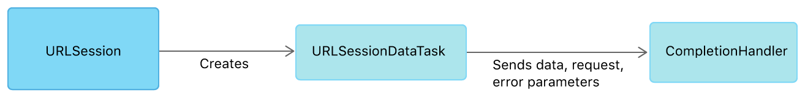

# URL Loading System

## Overview

The URL Loading System provides access to resources indentified by URLs, using standard protocols like https or custom protocols you create. Loading is performed asynchronously, so your app can remain responsive and handle incoming data or errors as they arrive.

You use a URLSession instance to create one or more URLSessionTask instances, which can fetch and return data to your app, download files, or upload data and files to remote locations. To configure a session, you use a URLSessionConfigure object, which controls behaviors like how to use caches and cookies, or whether to allow connections on a cellular network.


You can use a session to create tasks repeatedly. Each session is associated with a delegate to receive a periodic updates (or errors). The default delegate calls a completion handler block that you have provide; if you choose to provide your own custom delegate, this block is not called.

You can configure a session to run in background, so that while the app is suspended, the system can download data on its behalf and wake up the app to deliever the results.

## First Steps

Configure and create sessions, then use the to create tasks that interact with URLs.

### Fetch Website Data into Memory

#### Overview of Fetching Data

For small interactions with remote servers, you can use URLSessionDataTask class to receive response data into memeory (as opposed to using URLSessionDownloadTask class, which stores the data dorectly to the file system). A data task is ideal for uses like calling a webservice endpoint.

You use a URL session instance to create the task. If your needs are fairly simple, you can use the shared instance of the URLSession class. If you want to interact with transfer through delegate callbacks, you will need to create a session instead of using the shared instance. You use a URLSessionConfiguration instance when creating a session, also passing a class that implements URLSessionDelegate or one of its subprotols. Sessions can be reused to create multiple tasks, so far each unique configuration you need, create a session and store it as a property.

Once you have a session, you create a data task with one of the dataTask() methods. Tasks are created in a suspend state, and can be started by calling resume().

#### Receive Results with a Completion Handlar

The simplest way to fetch data is to create a data task that uses a completion hanlder. With this arguement, the task delievers the servers response, data, and possibly errors to a completionn handler block that you provide.



To create a data task that uses a completion handler, call the dataTask(with:) method of URLSession. Your completion handler needs to do three things:

1. Verify that error parameter is nil. If not, a transport error has occured; handle the error and exit.
2. Check the response parameter to vertify that the status code indicates success and that the MIME type is an expected type. If not, handle the server error and exit.
3. Use the data intances as needed.

```swift
func startLoad() {
    let url = URL(string: "https://www.example.com/")!
    let task = URLSession.shared.dataTask(with: url) { data, response, error in
        if let error = error {
            self.handleClientError(error)
            return
        }
        guard let httpResponse = response as? HTTPURLResponse,
            (200...299).contains(httpResponse.statusCode) else {
            self.handleServerError(response)
            return
        }
        if let mimeType = httpResponse.mimeType, mimeType == "text/html",
            let data = data,
            let string = String(data: data, encoding: .utf8) {
            DispatchQueue.main.async {
                self.webView.loadHTMLString(string, baseURL: url)
            }
        }
    }
    task.resume()
}
```

#### Receive Transfer Datails and Results with a delegate

For a greater level of access to the task's activuty as it proceeds, when creating the data task, you can set delegate on the session, rather providing a completion handler.


With this apporach, portions of the data are provided to urlSession(_:dataTask:didReceive:) method of URLSessionDataDelegate as they arrive until the transfer finishes or fails with an error. The delegate also receives pther  kind of events as the transfer proceeds.

You need to create your own URLSession instance when using delegate apporach, rather than using the  URLSession class's simple shared instance. Creating a new session allows you to set your own class as the sessions delegate.

Declare that your class implements one or more of the delegate protocols (URLSessionDelegate,URLSessionTaskDelegate, URLSessionDataDelegate, and URLSessionDownloadDelegate). Then create the URL session instance with the initializer init(configuration:delegate:delegateQueue:).  You can customize the configuration instance used with this initializer. 

```swift
private lazy var session: URLSession = {
    let configuration = URLSessionConfiguration.default
    configuration.waitsForConnectivity = true
    return URLSession(configuration: configuration,
                      delegate: self, delegateQueue: nil)
}()
var receivedData: Data?

func startLoad() {
    loadButton.isEnabled = false
    let url = URL(string: "https://www.example.com/")!
    receivedData = Data()
    let task = session.dataTask(with: url)
    task.resume()
}

// delegate methods

func urlSession(_ session: URLSession, dataTask: URLSessionDataTask, didReceive response: URLResponse,
                completionHandler: @escaping (URLSession.ResponseDisposition) -> Void) {
    guard let response = response as? HTTPURLResponse,
        (200...299).contains(response.statusCode),
        let mimeType = response.mimeType,
        mimeType == "text/html" else {
        completionHandler(.cancel)
        return
    }
    completionHandler(.allow)
}

func urlSession(_ session: URLSession, dataTask: URLSessionDataTask, didReceive data: Data) {
    self.receivedData?.append(data)
}

func urlSession(_ session: URLSession, task: URLSessionTask, didCompleteWithError error: Error?) {
    DispatchQueue.main.async {
        self.loadButton.isEnabled = true
        if let error = error {
            handleClientError(error)
        } else if let receivedData = self.receivedData,
            let string = String(data: receivedData, encoding: .utf8) {
            self.webView.loadHTMLString(string, baseURL: task.currentRequest?.url)
        }
    }
}
```

### Uploading Data to a Website

#### Overview of Uploading Data

Maby apps work with servers that accept uploads of files of images or documents, or use web  service API endpoints that accept struct  data like JSON. To upload data from your app, ypu use a URLSession instance to create a URLSessionUploadTask instance. The upload task uses a URLQuest instance that details how the upload is to be performed.

#### Prepare Your Data for Upload

The data to be upload can be a file, a stream, or data. Many web service endpoints take JSON-fotmatted data, which you create using a JSONEncoder class on Encodable types like arrays and dictionaries. You can declare a structure that conforms to Encodable, create an instance of this type, and use JSONEncoder to encode the instance to JSON Data for upload.

```swift
struct Order : Encodable {
    let customerId : String
    let items : [String]
}

let order = Order(customerId: "12345",
                  items: ["Cheese pizza", "Diet soda"])
guard let uploadData = try? JSONEncoder().encode(order) else {
    return
}
```

There are too many ways to create a data instance, such as encoding an image as JPEG or  PNG data, or converting a string to data by using an encoding like UTF-8.

#### Configure an Upload Request

An upload task requires a URLRequest instance. Set the httpMethod property of request to "POST" or "PUT", depending on what the server supports and expects. Use the setValue(_:forHTTPHeaderField:) method to set the values of any HTTP headers that you want to provide, except the Content-Length header. The session figures out the content length autimatically from the size of your data.

```swift
let url = URL(string: "https://example.com/post")!
var request = URLRequest(url: url)
request.httpMethod = "POST"
request.setValue("application/json", forHTTPHeaderField: "Content-Type")
```

#### Create and Start an Upload task

To begin an upload, call uploadTask(with:from:completionHandler:) method on a URLSession instance to create an uploading URLSessionTask instance, passing in the request and the data instance you've previously set up. Because tasks start in a suspend state, you begin the network loading process by calling resume() on the task.

```swift
let task = URLSession.shared.uploadTask(with: request, from: uploadData) { data, response, error in
    if let error = error {
        print ("error: \(error)")
        return
    }
    guard let response = response as? HTTPURLResponse,
        (200...299).contains(response.statusCode) else {
        print ("server error")
        return
    }
    if let mimeType = response.mimeType,
        mimeType == "application/json",
        let data = data,
        let dataString = String(data: data, encoding: .utf8) {
        print ("got data: \(dataString)")
    }
}
task.resume()
```

You can also upload data by setting a delegate.

### Uploading Streams of Data

#### Overview of Uploading stream