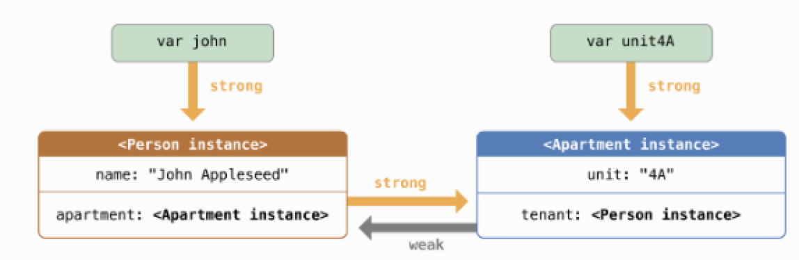
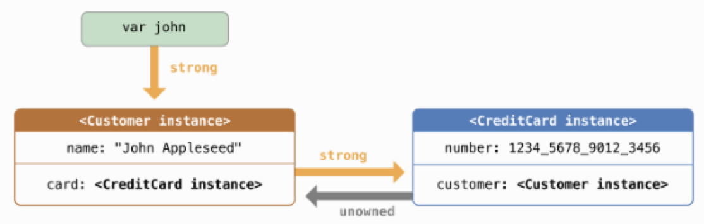

# Automatic Reference Counting

swift使用自动引用计数（ARC）来管理和追踪APP的内存使用情况，大多数情况下你只需知道在swift里面有内存管理的功能并且始终起着作用，而不需要知道它是如何工作的。当instance不会再被使用的时候，ARC会自动释放他所占的内存。

在极少数的情况下，为了管理APP的内存，ARC需要获取更多的代码不同部分之间的信息。这篇文章详细描述了这些情况，并展示了子这些情况下ARC管理内存的用法。

## How ARC Works

1. 每次新建累的实例时，ARC分配一块内存去存储实例的相关信息，包括实例的类型以及相关存储属性的值。
2. 当一个实例在以后APP的运行中不会再次使用到，ARC会自动释放他所占的内存以用作其他用途。这个机制保证保证类的实例在不会被再次使用的情况下不会占据内存空间。
3. 如果ARC释放了仍然在使用中的类的实例，那么从此以后实例的所有属性和方法都不能使用。尝试访问APP极大可能会崩溃。
4. 为了保证正在使用中的实例不会被释放，ARC会跟踪只想这个实例的引用数目，包括属性，常量和变量。只要有一个引用仍然活跃，ARC就不会释放实例所占内存。
5. 无论何时，你把一个实例赋值给其他类的属性，常量，或者变量，就会创建一个强引用（strong reference）指向这个实例。只要有强引用的存在，ARC就不会释放实例所占内存。

## ARC Action

```swift
class Person {
    let name: String
    init(name: String) {
        self.name = name
        print("\(name) is being initialized!")
    }
    var appartment: Apartment?
    deinit {
        print("\(name) is being deinitialized!")
    }
}
    var ref1: Person? = Person(name: "John")
    var ref2: Person? = ref1
    var ref3: Person? = ref1
    print("***** 1 ******")
    ref1 = nil
    print("***** 2 ******")
    ref2 = nil
    print("***** 3 ******")
    ref3 = nil

```

运行结果：

```text
John is being initialized!
***** 1 ******
***** 2 ******
***** 3 ******
John is being deinitialized!

```

## Strong Reference Cycles Between Class Instances

上面的例子中ARC很容易跟踪Person()实例的引用数量，并且在适当时间释放实例所占内存。但是可能出现这样的情况：一个类的实例的强引用技术永远不可能为0，比如两个类的实例互相持有对方的强引用。这种情况叫做强引用循环。

```swift
class Person {
    let name: String
    var appartment: Apartment?
    init(name: String) {
        self.name = name
        print("\(name) is being initialized!")
    }
    deinit {
        print("\(name) is being deinitialized!")
    }
}

class Apartment {
    let unit: String
    init(unit: String) {
        self.unit = unit
    }
    var tenant: Person?
    deinit {
        print("Apartment \(unit) is being deinitialized!")
    }
}

var john: Person? = Person(name: "John")
var apartment: Apartment? = Apartment(unit: "4A")
john?.appartment = apartment
apartment?.tenant = john
```

上述代码执行完成，实例之间相互关系如下：


```swift
john = nil
apartment = nil
```


很明显两个实例间的强引用关系并没有解除，两个实例的强引用计数都不是0，ARC机制也无法把两个实例所占内存释放，这会造成内存泄漏。

## Resolving Strong Reference Cycles between Class Instances

swift通过两种方式解决引用循环问题：弱引用和无主引用。

Weak and unowned reference enables one instance in a reference cycle to refer to the other instance without keeping a strong
 hold on it. The instance can then refer to each other without creating a strong reference cycle.

如果另一个实例可以先被释放，也就是另一个实例有更短的生命周期，采用弱引用。在上面的例子当中，在公寓其生命周期中，可以没有承租者，这种情况下应该使用弱引用来解决引用循环问题。相反，当另一个实例有相同或更长的生命周期的时候，应该使用无主引用来解决循环引用的问题。

### Weak Reference

A weak reference is a reference that doesn't keep a strong hold on the instance it refers to, and so doesn't stop ARC from disposing of the reference instance. This behavior prevents the reference from becoming part of a strong reference cycle. So it is possible for that instance to be deallocated while the weak reference is still refering to it. Therefore ARC automatically sets a weak reference to nil when the instance it refers to is deallocated. Because weak reference need to allow their values to be changed to nil at runtime, they are always declared as variables of an optional type.

```swift
class NewPerson {
    let name: String
    init(name: String) {
        self.name = name
        print("\(name) is being initialized!")
    }
    var appartment: NewApartment?
    deinit {
        print("\(name) is being deinitialized!")
    }
}
class NewApartment {
    let unit: String
    init(unit: String) {
        self.unit = unit
    }
    weak var tenant: NewPerson?
    deinit {
        print("Apartment \(unit) is being deinitialized!")
    }
}

var john: NewPerson? = NewPerson(name: "John")
var apartment: NewApartment? = NewApartment(unit: "4A")
john!.appartment = apartment
apartment!.tenant = john
```


```swift
print("Set John = nil")
john = nil
print("Set apartment = nil")
apartment = nil
```



运行结果：

```text
John is being initialized!
Set John = nil
John is being deinitialized!
Set apartment = nil
Apartment 4A is being deinitialized!
```

### Unowned Reference

Like a weak reference, an unowned reference doesn't keep a strong a hold on the instance it refers to. Unlike a weak reference, an unowned reference is used when the other instance has the same lifetime or a longer lifetime.

An unowned reference is expected to always has a value. As a result, ARC never sets a unowned reference 's value to nil, which means the unowned reference are deined using non-optional types.

Use an unowned reference only when you are sure that the reference is always refers to an instance that has not been deallocated. If you try to access the value of an unowned reference after that instance is deallocated, you will get a runtime error.

```swift
class Customer {
    let name: String
    var card: CreditCard?
    init(name: String) {
        self.name = name
    }
    deinit {
        print("\(name) is being deinitialized!")
    }
}

class CreditCard {
    let number: UInt64
    unowned let customer: Customer
    init(number: UInt64, customer: Customer) {
        self.number = number
        self.customer = customer
    }
    deinit {
        print("Card \(number) is being deinitialized!")
    }
}

var john: Customer? = Customer(name: "John")
john!.card = CreditCard(number: 1234_5678_9012_3456, customer: john!)
```



```swift
print("Set john = nil")
john = nil
```


运行结果：

```text
Set john = nil
John is being deinitialized!
Card 1234567890123456 is being deinitialized!
```

### Unowned References and Implicitly Unwrapped Optional Properties

弱引用和无主引用解决了两个场景下的循环引用问题：

1. Person和Apartment的例子，这个场景中两个属性都可以被设置为nil，可能导致循环引用。最好的解决方式是弱引用。
2. Customer和CreditCard的例子，这个场景中一个属性可以被设置为nil另外一个则一定不能为nil，可能导致循环引用。最好的解决方法是无主引用。

接下来分析第三种场景：

这个场景中一旦初始化完成，两个属性都不可以被设置为nil。解决方法是：无主引用和隐式解析可选属性结合。这样使得初始化完成之后两个属性都可以直接访问，同时可以避免循环引。

```swift
class Country {
    let name: String
    var capitalCity: City!
    init(name: String, capticalName: String) {
        self.name = name
        self.capitalCity = City(name: capticalName, country: self)
    }
}
class City {
    let name: String
    unowned let country: Country
    init(name: String, country: Country) {
        self.name = name
        self.country = country
    }
}
```

这个数据模型表述了一种关系：每个国家都一定有一个首都，每一个城市斗湖隶属于一个国家。所以Country有一个capticalCity的属性，而City有一个Country的属性。City的初始化在country初始化时被调用。然而Country在没有完全初始化完成之前并不能传递self给City。为了满足这个要求，声明capticalCity属性为隐式的可选解析类型。这样的话，capticalCity会有一个默认值（nil），进而只要Country的name属性在初始化函数中设置完成，整个Country就可以认为完全初始化了。这意味着只要name属性设定完成，我们就可以去访问和引用甚至传递隐式属性self作为参数给City的初始化函数用以构造capticalCity了。

```swift
var country : Country? = Country(name: "Canada", capticalName: "Ottawa")
print("\(country!.name)'s capital city is called \(country!.capitalCity.name)")
country = nil
```

运行结果：

```text
Canada's capital city is called Ottawa
Canada is being deinitialized!
Ottawa is being deinitialized!
```

## Strong Reference Cycles for Clousures

### How This Occurs

当把一个closure赋值给一个实例的属性，并且这个闭包又捕获（capture）了这个实例,循环引用就形成了。如果你在闭包里面尝试调用实例的方法（self.someMethod()）或者访问实例的属性（self.someProperty）,我们称之为闭包捕获了实例（self）。

```swift
class HTMLElement {
    let name: String
    let text: String?
    lazy var asHTML : () -> String = {
        if let text = self.text {
            return "<\(self.name)>\(text)</\(self.name)>"
        } else {
            return "<\(self.name) />"
        }
    }
    init(name: String, text: String? =  nil) {
        self.name = name
        self.text = text
    }
    deinit {
        print("\(name) is being deinitialized!")
    }
}
var paragraph: HTMLElement? = HTMLElement(name: "p", text: "hello, aorld!")
print(paragraph!.asHTML() as Any)
print("set paragraph = nil")
paragraph = nil
```

运行结果：

```text
<p>hello, aorld!</p>
set paragraph = nil
```

这里造成循环引用的本质原因是闭包也是引用类型。当你把包赋值给类的属性，就相当于设置了一个强引用指向闭包，进而类的实例和闭包之间形成循环引用，互相保证对方不会被释放掉。


### Resolving Stong Reference Cycles for Clousures

在闭包的声明中定义捕获列表（capture list）可以解决闭包相关的循环引用问题。捕获列表定义了闭包主题里面对于引用类型的使用规则。你可以声明捕获的引用类型为weak或者unowned，具体声明为什么类型取决于你的代码的不同部分之间的关系。

#### Weak and Unowned References

当闭包和实例互相引用，并且二者总是同时被释放，把捕获列表中的数据定义为Unowned；当捕获列表中的数据在某些时候偶会变成nil的情况下，定义为weak类型。弱引用类型总是可选类型，并且在实例被释放之后该引用会自动设置为nil，这个机制使得开发者可以在闭包里面判断引用指向的实例是否仍然存在。

```swift
class HTMLElement {
    let name: String
    let text: String?
        lazy var asHTML : () -> String = {
            [unowned self] in
            if let text = self.text {
                return "<\(self.name)>\(text)</\(self.name)>"
            } else {
                return "<\(self.name) />"
            }
        }
    init(name: String, text: String? =  nil) {
        self.name = name
        self.text = text
    }
    deinit {
        print("\(name) is being deinitialized!")
    }
}
var paragraph: HTMLElement? = HTMLElement(name: "p", text: "hello, aorld!")
print(paragraph!.asHTML())
print("set paragraph = nil")
```

运行结果：

```text
paragraph = nil
<p>hello, aorld!</p>
set paragraph = nil
p is being deinitialized!
```

这种情况下，形成的引用关系如下：

