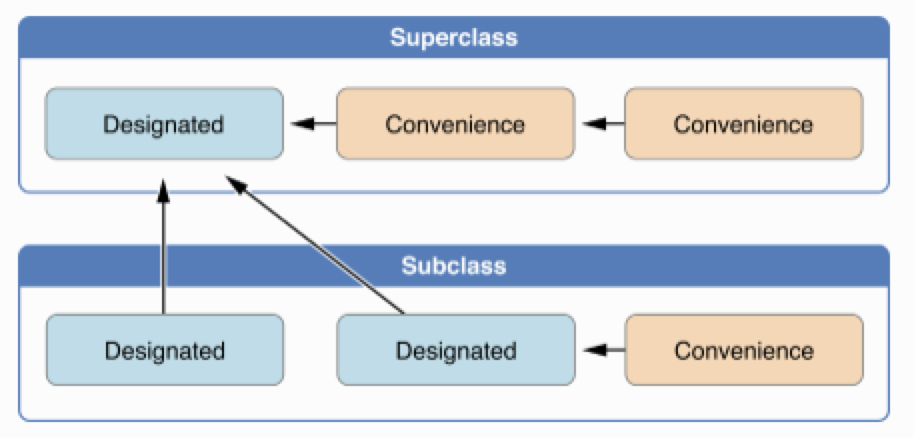
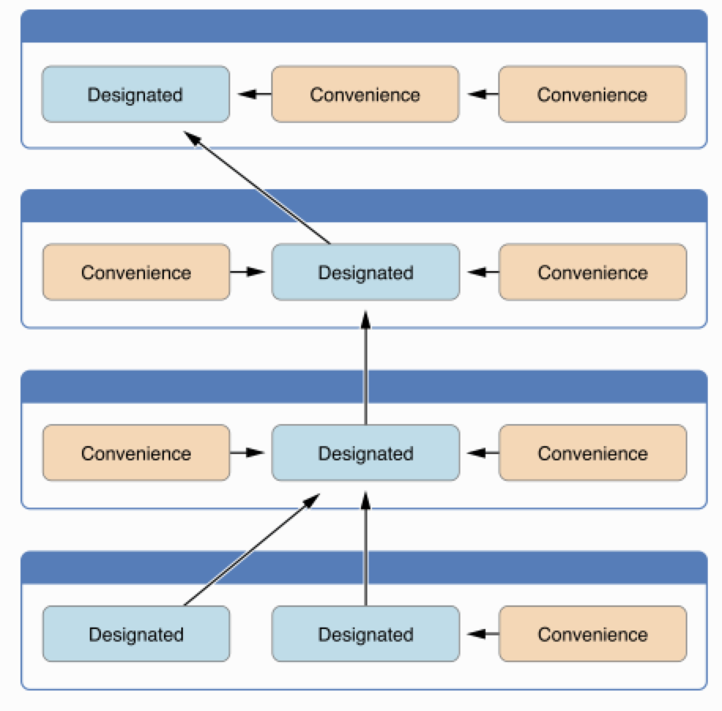

# 构造和析构(Initialization And Deinitialization)

初始化是准备类、街固体、枚举类型的实例的过程，包括给存储属性赋初值以及其他任何必要的设置和初始化。开发者通过定义构造器或者叫构造函数(Initializers)来实现初始化。通过调用构造函数来创建实例。swift的构造函数没有返回值，他们的主要作用是保证实例在第一次使用之前被正确的初始化。

类还可以定义一个析构函数或者叫析构器(Deinitializers)。实例销毁之前，系统会自动调用类的析构函数来做必要的清尾工作。

## 初始化(Initialization)

### 设定存储属性初值(Setting Initial Value for Stored Properties)

类和结构体必须(must)在实例创建之前给所有存储属性设置初值,存储属性不能处于不确定的状态。设定初值的方法有两个：构造函数和给定默认值。不管采用哪种方式，这些属性的初始值都是被直接设定的，不会调用任何属性观察者。

#### 构造函数/初始化器(Initializers)

```swift
struct Fahrenheit {
    var temperature : Double

    init(temperature : Double) {
        self.temperature = temperature
    }

    init() {
        temperature = 32.0
    }
}
```

#### 默认属性值(Default Property Value)

```swift
struct Fahrenheit {
    var temperature : Double = 32.0
}
```

### Customizing Initialization

开发者可以通过在初始化过程中传入参数和可选属性或者设定能够属性值为常数来定制实例的初始化。

#### 传参初始化(Initialization Parameters)

```swift
struct Celsius {
    var temperatureInCelsius : Double

    init(fromFahrenheit fahrenheit : Double) {
        temperatureInCelsius = ( fahrenheit - 32.0 ) / 1.8
    }
    init(fromKelvin kelvin: Double) {
        temperatureInCelsius = kelvin - 273.15
    }
    init(_ celsius : Double) {
        temperatureInCelsius = celsius
    }
}
```

#### Parameters Names and Arguement Label

Parameters Names ： 在函数体里面使用

Arguement Label ：调用函数是使用

由于构造函数并没有一个函数名(init是关键字),而一个类型可以有多个构造函数，创建实例的时候传入参数的类型和名称在构造函数的选择上起重要作用，所以如果开发者自己没有设定Arguement Label，swift为构造函数的每一个参数提供了一个默认的Arguement Label，与Parameters Names完全相同。

```swift
struct Color {
    let red, green, blue: Double
    init(red: Double,green: Double, blue: Double) {
        self.red = red
        self.green = green
        self.blue = blue
    }

    init(white: Double) {
        blue = white
        green = white
        red = white
    }
}

let magenta = Color(red: 1.0, green: 0, blue: 1.0)
let halfGray = Color(white: 0.5)
```

#### Initializer Parameters without Argument Labels

```swift
struct Celsius {
    var temperatureInCelsius : Double

    init(fromFahrenheit fahrenheit : Double) {
        temperatureInCelsius = ( fahrenheit - 32.0 ) / 1.8
    }
    init(fromKelvin kelvin: Double) {
        temperatureInCelsius = kelvin - 273.15
    }
    init(_ celsius : Double) {
        temperatureInCelsius = celsius
    }
}

let bodyTemperature = Celsius(37.0)
```

#### Optional Property Types

如果开发者自定义的类型的某个存储属性在逻辑及上允许为"no value"---可能原因之一初始化过程中无法赋值（其他依赖？）或者在未来的某个时间点这个属性可能为"no value"---定义这个属性为可选类型。可选类型的属性自动初始化为nil，表明这个属性"no value yet"。

```swift
class SurverQuestion {
    var text: String
    var response: String?

    init(text: String) {
        self.text = text
    }
    func ask() {
        print(text)
    }
}

let cheeseQuestion = SurverQuestion(text: "Do you like cheese?")
cheeseQuestion.ask()
cheeseQuestion.response = "Yes, I do like cheese."
```

#### Assigning Constant Properties During Initialization

可以在初始化过程中给常量属性设定初值，初始化结束长两属性就会有一个明确的值了，后续都不可更改了。

```swift
class SurverQuestion {
    let text: String
    var response: String?

    init(text: String) {
        self.text = text
    }
    func ask() {
        print(text)
    }
}

let beetsQuestion = SurverQuestion(text: "How about beets?")
beetsQuestion.ask()
beetsQuestion.response = "I also like cheese.(But not with cheese.)"
```

### 默认构造函数(默认构造器)

如果开发者没有提供构造函数，swift会为类和结构体提供一个默认构造函数。调用默认构造函数会创建一个实例，这个实例的所有属性值都是默认值。

```swift
class ShoppingListItem {
    var name : String?
    var quantity = 1
    var purchased = false
}

var item = ShoppingListItem()

struct Point {
    var x = 10
    var y = 20
}

let point = Point()
print("Item : \(String(describing: item.name)),\(item.quantity),\(item.purchased)")
print("The coordinate of point is (\(point.x),\(point.y)).")
```

运行结果：

```text
Item : nil,1,false
The coordinate of point is (10,20)
```

#### Memberwise Initializers for Structure Types

swift还会为结构体提供一个默认的逐个成员初始化的构造函数(Memberwise Initializers)。结构体所有成员属性都有默认值的时候可有调用默认构造函数或者逐个属性初始化的构造函数；否则在不提供构造函数的情况下，会调用这这个构造函数去逐个初始化属性。

```swift
struct Point {
    var x : Int
    var y : Int
}
var point = Point(x: 10, y: 30)
```

### Initializers Delegation for Value Types

构造函数可以调用其他类的构造函数完成实例的部分初始化，这个过程称作构造器代理，避免了多个构造器中出现重复代码。值类型不支持继承，所以代理过程性对简单。在实现自己的构造函数时，使用self.init去调用其他的构造函数。注意：self.init只能在构造函数中使用。

对于值类型，如果开发者自己定义了构造函数，那么默认构造函数和逐个属性初始化的构造函数就不会再被调用用来创建实例了，这个限制机制预防了这样一种情况：本来有一部分重要的工作要在自定义的构造函数完成，创建的实例的时候却错误的调用了系统自动产生的构造函数。当然如果你想在自定义构造函数的情况下还想使用系统产生的构造函数，解决方法：在extension中实现自己的构造函数。

```swift
struct Point {
    var x = 0.0
    var y = 0.0
}

struct Size {
    var width = 0.0
    var height = 0.0
}

struct Rect {
    var origin = Point()
    var size = Size()

    init() {}

    init(origin : Point, size : Size) {
        self.origin = origin
        self.size = size
    }

    init(center : Point, size : Size) {
        let originX = center.x - size.width / 2
        let originY = center.y - size.height / 2
        //Initializer Delegation
        self.init(origin: Point(x: originX, y: originY), size: size)
    }

    func toString() -> String {
        return "Rect : origin = (\(origin.x),\(origin.y)), size = (width : \(size.width), height : \(size.height))"
    }
}

let basicRect = Rect()
print(basicRect.toString())
let originRect = Rect(origin: Point(x: 2.0, y: 2.0), size: Size(width: 5.0, height: 5.0))
print(originRect.toString())
let centerRect = Rect(center: Point(x: 4.0, y: 4.0), size: Size(width: 3.0, height: 3.0))
print(centerRect.toString())
```

运行结果：

```text
Rect : origin = (0.0,0.0), size = (width : 0.0, height : 0.0)
Rect : origin = (2.0,2.0), size = (width : 5.0, height : 5.0)
Rect : origin = (2.5,2.5), size = (width : 3.0, height : 3.0)
```

### 类的继承和初始化(Class Inheritance and Initialization)

类的所有存储属性包括继承自父类的在初始化过程中都必须(must)设定初值。Swift为了确保初始化过程正确完成，定义了两种构造函数(构造器)：指定构造器(Designated Initializer)和便利构造器(Convenience Initializer)。

#### 指定构造器和便利构造器

指定构造器是类的最重要的构造器，可以定义一个或者多个。指定构造器必须完整的初始化所有实例存储属性（自定义的属性和从父类继承来的属性）。指定构造器可以通过父类链调用恰当的父类的构造器初始化继承来的属性，还必须对本类自定义的实例存储属性进行初始化。

便利构造器是次要的、辅助性的构造器，类里面可以不定义遍历构造器，便利构造器必须调用其他构造器来完成初始化。

#### 类的构造器代理(Initializer Delegation of Class Types)

swift使用下面三条规则来简化便利构造器和指定构造器的调用关系：

1. 指定构造器必须调用直接父类的指定构造器（如果有直接父类）。
2. 便利构造器必须调用同一个类中的其他构造器。
3. 便利构造器调用的构造器链的最终节点必须是指定构造器。

简化为：

1. 指定构造器必须向上代理（调用父类指定构造器）。
2. 便利构造器必须横向代理（调用当前类的其他构造器，调用的终点是指定构造器）。

构造器中调用其他构造器来执行构造的过程叫做构造器代理。





#### 两段式构造(Two-Phase Initialization)

swift中的类的构造需要两个阶段完成：

1. 初始化存储属性。使用本类的构造器初始化本类定义的存储属性，沿着构造器链向上逐个调用父类的构造器初始化父类的存储属性。
2. 从最顶层父类开始，沿着顶部构造器链向下，每个构造器可以再次修改存储属性。

详细过程如下：

第一阶段：

1. 调用子类的某个构造器
2. 为实例分配内存，此时实例的内存还没与被初始化
3. 指定构造器确保子类所有的存储属性都已经初始化完成
4. 指定构造器调用父类的构造器，完成父类定义的的存储属性的初始化
5. 沿着继承树上溯，即沿着调用父类构造器的构造器链一直向上执行，知道到达构造器链的最顶部。到达最顶部时，各个父类指定构造器完成各自定义的存储属性的初始化

第二阶段：

1. 沿着继承树向下，构造器链中的构造器有机会进一步定制实例，构造器此时可以修改实例属性，访问self，甚至可以调用实例方法。
2. 最后构造器链中的便利构造器有机会定制实例和使用self。

两段式构造使得构造过程更加安全，同时让整个类层次中的类获得了完全的控制权。两段式构造可以防止属性初始化之前被访问，也可以防止属性被另一个构造器意外的赋予不同的值。

为保证两段式构造的顺利完成，swift提供了四项安全检查：

1. 指定构造器必须先初始化当前类中的定义的存储属性，在向上调用父类构造器。
2. 指定构造器必须先向上调用父类的构造器，才能对继承得到的属性赋值。原因：如果先赋值再调用父类构造器，那么父类构造器会把刚刚指定构造器赋的值覆盖掉。
3. 便利构造器必须先调用同一个类的其他构造器，然后才能对属性赋值。原因：先对属性赋值再调用其他构造器，那么其他构造器会把便利构造器刚刚的赋值覆盖掉。(self.init()必须位于属性赋值、属性访问代码之前。)
4. 构造器在第一阶段完成之前不能调用实例方法，不能读取实例属性。

```swift
class Fruit {
    var name : String
    var weight : Double
    //Designated Initializer
    init(name: String, weight : Double) {
        self.name = name
        self.weight = weight
    }

    //Convenience Initializer
    //便利构造器必须调用指定构造器
    convenience init(name : String){
        self.init(name: name, weight: 0.0)
    }
    //Convenience Initializer
    //必须先调用指定构造器再设定属性值(Safety check)
    convenience init() {
        self.init(name: "Fruit")
        self.weight = 1.0
    }
}

class Apple : Fruit {
    var color : String

    //指定构造器必须先初始化自定义的属性，在向上调用父类的指定构造器
    init(name : String,weight:Double,color:String){
        self.color = color
        super.init(name: name, weight: weight)
    }

    convenience init(name: String,color: String){
        self.init(name: name, weight: 1.0, color: color)
    }
}
```

#### 构造器的继承和重写(Initializer Inheritance and Overriding)

默认情况Swift的子类不会继承父类的构造器。只有满足以下条件，子类才会自动继承父类构造器：

1. 子类没有提供任何指定构造器，则自动继承父类所有的子类构造器
2. 子类实现了父类所有的指定构造器，即子类继承或者重写了父类所有的指定构造器，那么子类自动继承父类的便利构造器。

如果子类中定义的构造器和父类的指定构造器形参列表、外部形参名相同，即认为重写了父类的构造器。相反的，如果子类构造器和父类的便利构造器的形参列表、外部参数名相同，由于子类中永远不可能直接调用父类的便利构造器，因此不算构造器重写。

```swift
class Fruit {
    var name : String
    var weight : Double

    //Designated Initializer
    init(name: String, weight : Double) {
        self.name = name
        self.weight = weight
    }

    init() {
        self.name = "Unnamed"
        self.weight =  0.0
    }
    //Convenience Initializer
    convenience init(name : String){
        self.init(name: name, weight: 0.0)
    }

}

//提供了自己的指定构造器，不满足规则1，所以不会继承父类的构造器
class Apple : Fruit {
    var color : String
    init(name : String,weight:Double,color:String){
        self.color = color
        super.init(name: name, weight: weight)
    }
    //重写父类的指定构造器
    override init(name: String, weight: Double) {
        color = "defaultColor"
        super.init(name: name, weight: weight)
    }

    //与父类便利构造器参数相同，但不是重写
    init(name: String) {
        color = "defaultColor"
        super.init(name: name, weight: 0.0)
    }

    convenience init(name: String,color: String){
        self.init(name: name, weight: 1.0, color: color)
    }

    //通过便利构造器重写父类构造器
    override convenience init() {
        self.init(name:"Unnamed")
    }

}
//没有定义任何构造器，所以继承了父类的所有指定构造器，进而继承了父类的所有便利构造器
class Fuji : Apple {
    var vitamin : Double = 0.21
}

```

### 可能失败的构造器(Failable Initializers)

某些情况下可能会出现初始化失败的情况：提供了无效的参数值，外部资源的缺失等等。比如：

```swift
let wholeNumber: Double = 12345.0
let pi = 3.14159

if let valueMaintained = Int(exactly: wholeNumber) {
    print("\(wholeNumber) connversion to Int maintains value of \(valueMaintained).")
}

let valueChanged = Int(exactly: pi)
if nil == valueChanged {
    print("\(pi) conversion to Int does not maintain value.")
}
```

解决方法是提供可能失败的构造器(Failable Initializers).

```swift
class Animal {
    var name: String

    init?(name: String) {
        if name.isEmpty {
            return nil
        }
        self.name = name
    }
}

enum TemperatureUnit {
    case kelvin, celcius, fahrenheit

    init?(symbol: Character) {
        switch symbol {
        case "K":
            self = .kelvin
        case "C":
            self = .celcius
        case "F":
            self = .fahrenheit
        default:
            return nil
        }
    }
}
//Enumetations with raw values automatically receive a failable initializer
enum TemperatureUint2 : Character {
    case kelvin = "K"
    case celcius = "C"
    case fahrenheit = "F"
}
```

#### 可能失败构造器的传播(Propagation of Initialization Failure)

类、结构体和枚举的构造器可以横向调用该类、结构体或者枚举的另一个可能失败的构造器；类似的，子类的可能失败构造器也可以向上调用父类的可能失败构造器。并且可能失败的构造器和一般的构造器之间也可以相互调用。由于可能失败的构造器会进行传播，因此可能失败的构造器在构造过程失败之后，构造失败行为会立即阻止原构造器代码继续执行（因为返回了nil）。

```swift
class Product {
    let name: String
    init?(name: String) {
        print("Start create Product!")
        if name.isEmpty {
            print("Failure to create Product because of empty name!")
            return nil
        }
        self.name = name
    }
}

class CartItem: Product {
    let quantity: Int
    init?(name: String, quantity: Int) {
        print("Start create CartItem!")
        if quantity < 1 {
            print("Failure to create CartItem because of quantity!")
            return nil
        }
        self.quantity = quantity
        super.init(name: name)
    }
}

let twoSock = CartItem(name: "Sock", quantity: 2)
if nil != twoSock {
    print("Succeed to create twoSock!")
}
let zeroSock = CartItem(name: "Sock", quantity: 0)
if nil != zeroSock {
    print("Succeed to create zeroSock!")
}
let unnamedSock = CartItem(name: "", quantity: 4)
if nil != zeroSock {
    print("Succeed to create unnamedSock!")
}
```

运行结果：

```text
Start create CartItem!
Start create Product!
Succeed to create twoSock!
Start create CartItem!
Failure to create CartItem because of quantity!
Start create CartItem!
Start create Product!
Failure to create Product because of empty name!
```

#### 重写可能失败的构造器(Overriding a Failable Initializer)

子类可以重写父类中能够可能失败的构造器，可以通过可能失败的构造器重写父类可能失败的构造器，也可以通过一般的构造器重写父类可能失败的构造器-----保证被重写后的构造器一定成功。

需要注意：

1. 子类的普通构造器向上调用父类的可能失败的构造器，需要进行解析，要么强制解析要么隐式解析。
2. 普通构造器调用自身的可能失败构造器，也需要解析。

```swift
class Document {
    var name: String?
    init() {
    }
    init?(name: String) {
        if name.isEmpty {
            return nil
        }
        self.name = name
    }
}

class AutomaticallyNamedDocument: Document {
    override init() {
        super.init()
        self.name = "Unnamed"
    }
    //一般构造器重写可能失败构造器，
    override init(name: String) {
        super.init()
        if name.isEmpty {
            self.name = "Unnamed"
        } else {
            self.name = name
        }
    }
}

class UntitledDocument: Document {
    //一般构造器调用可能失败构造器，需要解析
    override init() {
        super.init(name: "Untitled")!
    }
}
```

### 子类必须实现的构造器(Required Initializer)

Swift允许在构造器前面加上required关键字，表明所有子类必须实现这个构造器。具体是继承还是自己编码实现，是指定构造器还是便利构造器，swift不做明确要求。

```swift
class Fruit {
    var name: String
    var weight: Double
    //Required Designated Initializer
    required init(name: String){
        self.name = name
        self.weight = 0.0
    }
    //Required Convenience Initializer
    required convenience init(name: String, weight: Double) {
        self.init(name: name)
        self.weight = weight
    }
}

class Apple: Fruit {
    var color: String
    //Implement Required Designated Initializer
    required init(name: String) {
        self.color = "Red"
        super.init(name: name)
    }
    init(color: String) {
        self.color = color
        super.init(name: "")
    }
    //Implement Convenience Designated Initializer
    required convenience init(name: String, weight: Double) {
        self.init(color:"Red")
        super.name = name
    }
}

//Receive Required Initializers by Inheritance
class Grape: Apple {
    var sugarRate: Double = 0.45
}
```

### Setting a Default Property Value with a Clousure or Function

存储属性的默认值需要一系列的配置和计算的时候，可以使用全局函数或者闭包。创建实例的时候，闭包或者函数就会被调用，返回值作为该存储属性的默认值。

```swift
struct ChessBoard {
    var boardColors : [Bool] = {
        var temporaryBoard = [Bool]()
        var isBlack = false
        for i in 1...8 {
            for j in 1...8 {
                temporaryBoard.append(isBlack)
                isBlack = !isBlack
            }
            isBlack = !isBlack
        }
        return temporaryBoard
    }()
}
```

## 析构(Deinitialization)

类的实例被释的时候会立即调用析构函数或者析构器。注意：只针对类。

在类的实例被销毁之前，程序需要释放一些物理资源（并非内存，内存由系统自己释放），比如打开的文件和网络连接等。这个工作可以在析构函数（析构器）中完成。析构器是一个名为dinit的函数，无参数无返回值甚至没有圆括号。析构器由系统自己调用，开发者不能手动调用。子类默认继承父类的析构器。如果子类自己实现了析构器，那么子类析构器执行结束时调用父类析构器。总之，子类析构器一定会调用父类的析构器。

由于析构器被调用完成，实例才被销毁，因此可以在析构器里面访问类的存储属性或者根据这些属性来关闭资源。

```swift
class Birds{
    var sing  = "sing"
    deinit {
        print("bird is to be deallocked")
        if "sing" == self.sing {
            self.sing = "stop"
        }
    }
}
class Chick: Birds {
    var run = "run"
    deinit {
        print("chick is to be deallocked!")
        if self.run == "run" {
            self.run = "stop"
        }
    }
}


var chick : Chick? = Chick()
chick = nil
```

运行结果：

```text
chick is to be deallocked!
bird is to be deallocked
```