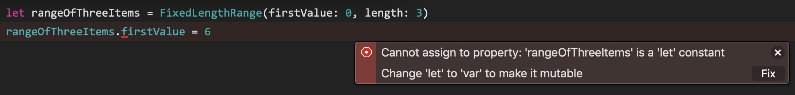
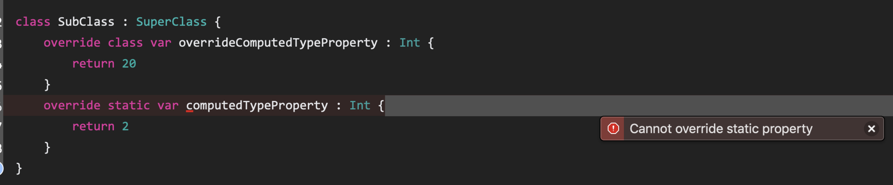

# swift的结构体和类

swift中，我们在一个文件中定义结构体和类并实现他的接口。

## 基础知识

### 结构体和类的比较

相同点：

1. 属性：保存数据
2. 方法：实现功能
3. 下标：通过下标语法访问属性
4. 初始化器
5. 扩展：默认实现增加功能
6. 遵循协议：实现特定类型的标准功能

不同点：

1. 继承：其他类的属性和方法
2. 类型转换：运行时check和interpret一个实例的类型
3. 析构器：释放实例占用的资源
4. 引用类型：引用计数允许多个引用关联到同一个实例

### 定义语法和实例化

```swift
struct Resolution {
    var width = 0
    var height = 0
}

class ViewMode {
    var resolution = Resolution(width: 2, height: 3)
    var interlaced = false
    var frameRate = 0.0
    var name: String?
}

var viewMode = ViewMode()
```

需要注意：所有的结构体都会自动生成一个memberwise initializer用于在初始化实例的时候初始化成员属性。

### 访问结构体和类的属性

使用用dot(.)语法访问和修改类的属性。

```swift
print("The width of some view mode is \(viewMode.resolution.width)")
viewMode.resolution.width = 1280
```

### 结构体和枚举都是值类型

A value type is a type whose value is copied when it is assigned to a variable or constant, or it's passed to a function. Reference types are not copied when they are assigned to a variable or constant, or when they are passed to a function. Rather than a copy, a reference to the same existing instance is used.

swift中所有的基本类型都是值类型，包括整型，浮点型，布尔型，字符串，数组，字典，集合，底层实现方式都是结构体。结构体和枚举都是值类型，任何时候创建结构体和枚举实例，不管他们的属性的类型是什么，都会复制。不过集合类型在实现上做了优化，即所谓的copy-on-write机制。

```swift
struct Resolution {
    var width = 0
    var height = 0
}
var hd = Resolution(width: 1920, height: 1080)
var cinema = hd
print("Cinama is \(cinema.width) pixels width, hd is \(hd.width) pixels width!")
cinema.width = 2048
print("Now cinama is \(cinema.width) pixels width, hd is still \(hd.width) pixels width!")
```

运行结果：

```txt
Cinama is 1920 pixels width, hd is 1920 pixels width!
Now cinama is 2048 pixels width, hd is still 1920 pixels width!
```

内存布局：


相同的机制在枚举类型中的应用：

```swift
enum CompassPoint {
    case north,sourth,east,west
    mutating func turnNorth() {
        self = .north
    }
}

var currentDirection = CompassPoint.east
var rememberedDirection = currentDirection
rememberedDirection.turnNorth()
print("The current direction is \(currentDirection)")
print("The remembered Direction is \(rememberedDirection)")
```

运行结果：

```txt
The current direction is east
The remembered Direction is north
```

接下来验证集合类型的copy-on-write机制。由运行结果可得，在修改实例数据之前，arr和arrCopy挂联的是同一个实例；修改数据之后，两者关联了不同实例，真正复制了arr存放在内存中。

```swift
var arr = Array<Int>()
var arrCopy = arr
var str = String(format: "%p %p", arguments: [arr,arrCopy])
print("The addresses of arr and arrCopy : \(str).")
arrCopy.append(12)
str = String(format: "%p %p", arguments: [arr,arrCopy])
print("The addresses of arr and arrCopy : \(str).")
```

运行结果：

```txt
The addresses of arr and arrCopy : 0x107acb750 0x107acb750.
The addresses of arr and arrCopy : 0x107acb750 0x60000355e180.
```

### 类是引用类型

Reference types are not copied when they are assigned to a variable or constant, or when they are passed to a function. Rather than a copy, a reference to the same existing instance is used.

```swift
let tenEighty = ViewMode()
tenEighty.resolution = hd
tenEighty.interlaced = true
tenEighty.name = "1080i"
tenEighty.frameRate = 25.0

let alsoTenEighty = tenEighty

print("tenEight's frame rate = \(tenEighty.frameRate) alsoTenEighty's frame rate = \(alsoTenEighty.frameRate)")
alsoTenEighty.frameRate = 30.0
print("tenEight's frame rate = \(tenEighty.frameRate) alsoTenEighty's frame rate = \(alsoTenEighty.frameRate)")
```

运行结果：

```txt
tenEight's frame rate = 25.0 alsoTenEighty's frame rate = 25.0
tenEight's frame rate = 30.0 alsoTenEighty's frame rate = 30.0
```

很明显我们修改了alsoTenEighty的frameRate值，tenEighty的对应值也跟着改变，因为类是引用类型，他两个指向同一块内存。tenEighty和alsoTenEighty是同一个实例的不同名字，


需要注意，alsoTenEighty和tenEighty都是常量，但是我们仍然可以修改frameRate的值，这是因为enEighty和alsoTenEighty的值的确没有发生改变，他们并不是ViewMode的instance，而是都指向这个实例，可以理解为保存的是实例的指针。

#### Identity Operator

由于类是引用类型，所以很可能出现多个变量或者常量指向同一个实例的情况。对于值类型却不一样，每次赋值或者作为参数传递都会复制一份新的数据。所以swift提供了两个操作符在判断两个常量或者变量是否指向同一个实例：

1. Identical to(===)
2. Not Identical to(!==)

```swift
print("alseTenEighty and tenEighty refer to \(tenEighty === alsoTenEighty ? "same" : "different") instance.")
```

运行结果：

```txt
alseTenEighty and tenEighty refer to same instance.
```

应该注意，Indentical to(===)意味着两个变量或者常量指向类的同一个实例；而Equal to(==)意味着两个变量或者常量的值相等。自定义的结构体或者类大部分时候需要开发者自己定义(==)的含义。

#### 指针

swift标准库提供了pointer和buffer type让开发者直接使用指针。参考：
[Manual Memory Management](https://developer.apple.com/documentation/swift/swift_standard_library/manual_memory_management "Manual Memory Management")

## 属性(Properties)

存储属性（Stored Properties）是存储在结构体和类里面的常量或者变量。计算属性(Computed Properties)用于计算而不是存储一个数据(value)，适用于结构体、类和枚举。

一般类说存储属性和计算属性和类的特定实例相关，但是有的属性可以和这个类型相关，称作类属性(Type Property)。

对于存储属性，不管是继承自父类还是自己定义的，都可以添加属性观察者来监控那个属性值的变化，进而做出响应。

### 存储属性(Stored Properties)

在结构体和类里面可以定义存储属性，可以使常量(let声明)或者变量(var声明)。存储属性可以设定默认值，也可以在构造函数里面设定初值或修改他的默认值。特殊地方在于，对于常量，只有这两个地方可以设定或者改变它的值。

```swift
struct FixedLengthRange {
    var firstValue = 0
    let length : Int
}

var rangeOfThreeItems = FixedLengthRange(firstValue: 0, length: 3)
rangeOfThreeItems.firstValue = 6
```

### 结构体常量的存储属性



根本原因是结构体是值类型，常量结构体的存储属性一定都是常量。对于引用类型(Class)则不然不然,比如下面代码就没有问题：

```swift
let tenEighty = ViewMode()
tenEighty.resolution = hd
tenEighty.interlaced = true
tenEighty.name = "1080i"
tenEighty.frameRate = 25.0
```

### 延迟存储属性(Lazy Stored Properties)

延迟存储属性的初始化在它第一次使用的时候完成，适用于以下两种情况：

1. 属性的初值依赖于其他外部因素，这些外部因素的具体数值在实例完成初始化之前无法获取。
2. 属性的初始值的设定需要复杂的计算或者费时的操作，这种情况下只能这样处理。

需要注意，如果延迟加载的属性尚未被初始化并且有多个线程会去访问它，那么我们无法保证它只被初始化一次，即无法保证线程安全。

```swift
class DataImpoter {
    var name : String
    var fileName = "data.txt"
    init(_ name : String) {
        self.name = name
        print("DataImpoter named \(self.name) will be initialized!")
    }
}

class DataManager {
    lazy var lazyImpoter = DataImpoter("LazyDataImpoter")
    var impoter = DataImpoter("Impoter")
    var data = [String]()
}

let manager = DataManager()
manager.data.append("some data")
manager.data.append("some more data")
print("*****************")
manager.lazyImpoter.fileName = "lazyData.txt"
```

运行结果：

```txt
DataImpoter named Impoter will be initialized!
*****************
DataImpoter named LazyDataImpoter will be initialized!
```

## 计算属性(Computed Properties)

```txt
Classes, structures and enumerations can define computed properties, which don't actually store a value. Instead, they provide a getter and an optional setter to retrieve and set other properties and values indirectly.
```

```swift
struct Point {
    var x = 0.0
    var y = 0.0
}
struct Size {
    var width = 0.0
    var height = 0.0
}
struct Rect {
    var origin = Point()
    var size = Size()
    var center : Point {
        get {
            print("\(#function) getter is invoked!")
            let centerX = origin.x + size.width / 2.0
            let centerY = origin.y + size.height / 2.0
            return Point(x: centerX, y: centerY)
        }
        set(newcenter) {
            print("\(#function) setter is invoked!")
            origin.x = newcenter.x - size.width / 2.0
            origin.y = newcenter.y - size.height / 2.0
        }
    }
}

var squre = Rect(origin: Point(x: 0.0, y: 0.0), size: Size(width: 10.0, height: 10.0))
let initcenter = squre.center
squre.center = Point(x: 15.0, y: 15.0)
```

运行结果：

```txt
center getter is invoked!
center setter is invoked!
```

由上面的例子可以看出：假定Rect的size不变的情况下，center的改变会引起origin的改变；另外origin和size的变化都会引起center的变化。所以我们把center设定为计算属性，在我们改变center的时候同时更新origin的值，在我们需要获取center的时候，就根据origin和size来计算。如果没有这种机制，我们更新center的同时需要显式的更新origin，修改origin和size的时候需要显式的更新center。总的来说计算属性描述的是类、结构体和枚举的存储属性之间的相互关系。

### setter的快捷表示方法(Shorthand setter declaration)

默认传入newValue作为参数名字。

```swift
struct Rect {
    var origin = Point()
    var size = Size()

    var centre : Point {
        get {
            print("\(#function) getter is invoked!")
            let centreX = origin.x + size.width / 2.0
            let centreY = origin.y + size.height / 2.0
            return Point(x: centreX, y: centreY)
        }
        set {
            print("\(#function) setter is invoked!")
            origin.x = newValue.x - size.width / 2.0
            origin.y = newValue.y - size.height / 2.0
        }
    }
}
```

### 只读计算属性(Read-only Computed Properties)

如果计算属性只有getter函数而没有setter函数，我们称之为只读计算属性，这种属性总是返回一个数值，但是不能设定一个新的数值。以下例子中：volume的数值依赖于width，height，和depth，三者任一发生改变，volume都会发生变化，所以定义volume为只读计算属性，用以返回当前的立方体体积。

```swift
struct Cuboid {
    var width  = 0.0
    var length = 0.0
    var height = 0.0
    //read-only
    var volume : Double {
        return width * height * length
    }
}
```

## 属性观察者(Property Observer)

Property observers observe ang respond to changes in a property value. Property observers are called every time a property's value is set, even if the new value is the same as the property's current value.

开发者可以给任意自定义的存储属性添加observer，可以给任意继承的的属性（存储属性和计算属性）添加观察者。但是没有必要为nonoverriden的计算属性添加观察者，因为你可以在setter函数中注意到属性数值的变化并做出反应。

1. willSet---->is Called before the value is storted.传入一个newValue(如果开发者不在自己的实现中不修改参数名称的话)作为即将设定给属性的数值。
2. didSet----->is called immediately after the new value is stored.参数名称是oldValue（如果开发者不在自己的实现中不修改参数名称的话）。

```swift
class StepCounter {
    var totalSteps : Int = 0 {
        willSet {
            print("new value = \(newValue)")
        }
        didSet {
            print("old value = \(oldValue)")
        }
    }
}
func testPropertyObserver()  {
    let stepCounter = StepCounter()
    stepCounter.totalSteps = 200
    stepCounter.totalSteps = 360
    stepCounter.totalSteps = 896
}
testPropertyObserver()
```

运行结果：

```txt
new value = 200
old value = 0
new value = 360
old value = 200
new value = 896
old value = 360
```

需要注意：

1. 父类属性的观察者：在父类构造完成之前不会被调用。
2. 如果把带有属性观察者的属性作为in-out参数传递，那么willSet和didSet一定会被调用。原因：函数调用结束的时候，数值会再次写入到属性当中。

## 全局变量和局部变量

存储属性------->存储变量

计算属性------->计算变量

属性观察者----->存储变量

需要注意：全局的变量和常量默认都是延迟加载的，虽然没有用lazy修饰；局部的常量和变量都是都不会延迟计算和加载。

## 类型属性(Type Properties)

实例的属性属于单个实例，每次创建一个类型的实例，实例属性都有自己的一系列和其他同类型实例毫不相干的数值。开发者也可以定义属于整个类型的属性，称作类型属性（type properties）。不管有创建多少个实例，内存中只有一份copy保存这些属性。

应用场合：一些属性与类型相关而不是和各个实例相关，比如一个银行账户类可能需要有一个属性表示当前的基准利率，很明显考虑现实意义，利率应该与类关联，而不是与每个账户关联。

### Type Propertiey Syntax

语法：结构体、枚举和类里面都可以用static修饰，对于类的计算属性，如果允许子类ovveride重新实现，就用class修饰。

```swift
struct SomeStruct {
    static var storedTypeProperty = "some value"
    static var computedTypeProperty : Int {
        return 1
    }
}

enum SomeEnumeration {
    static var storedTypeProperty = "some value"
    static var computedTypeProperty : Int {
        return 1
    }
}

class SuperClass {
    static var storedTypeProperty = "some value"
    static var computedTypeProperty : Int {
        return 1
    }
    class var overrideComputedTypeProperty : Int {
        return 1
    }
}

class SubClass : SuperClass {
    override class var overrideComputedTypeProperty : Int {
        return 20
    }
}
```

另外：static修饰的计算变量不可以备重载：



### Querying and Setting Type Properties

```swift
struct AudioChannel {
    static let thresholdLevel = 10
    static var maxInputLevelForAllChannels = 0
    var currentLevel : Int = 0 {
        didSet{
            if currentLevel > AudioChannel.thresholdLevel {
                currentLevel = AudioChannel.thresholdLevel
            }

            if currentLevel > AudioChannel.maxInputLevelForAllChannels {
                AudioChannel.maxInputLevelForAllChannels = currentLevel
            }
        }
    }
}
func testTypedProperties()  {
    var leftChannel = AudioChannel()
    var rightChannel = AudioChannel()
    leftChannel.currentLevel = 7
    print("max = \(AudioChannel.maxInputLevelForAllChannels) leftChannelCurrentLevel = \(leftChannel.currentLevel)")
    rightChannel.currentLevel = 11
    print("max = \(AudioChannel.maxInputLevelForAllChannels) rightChannelCurrentLevel = \(rightChannel.currentLevel)")
    print("max = \(AudioChannel.maxInputLevelForAllChannels) leftChannelCurrentLevel = \(leftChannel.currentLevel)")
}

testTypedProperties()

```

运行结果：

```txt
max = 7 leftChannelCurrentLevel = 7
max = 10 rightChannelCurrentLevel = 10
max = 10 leftChannelCurrentLevel = 7
```

## Method(方法)

Methods are functions that are associated with a particular type. Classes, structures, and enumerations can call instance methods and type methods。In swift，you can choose whether to define a class, structure, or enumeration, and still have the flexibility to define methods on type you create.

### Instance Methods(实例方法)

实例方法是从属于类、结构体或者枚举的实例的函数。

```swift
class Counter {
    var count = 0

    func increment() {
        count += 1
    }

    func increment(by amount : Int) {
        count += amount
    }

    func reset() {
        count = 0
    }
}

let counter = Counter()
counter.increment()
counter.increment(by: 2)
counter.reset()
```

### The Self Property

每个实例都有一个隐式的属性叫做self，等价于实例本身，用来在实例方法中引用当前实例，在大多数情况下可以省略。但有一种例外，实例方法的参数名字和实例属性的名字相同，这种情况下为了区分二者，必须使用self.someProperty.

```swift
struct Point {
    var x = 0.0
    var y = 0.0

    func isToTheRightOf(x : Double) -> Bool {
        return self.x > x
    }
}

let somePoint = Point(x: 4.0, y: 5.0)
if somePoint.isToTheRightOf(x: 1.0) {
    print("The point is to the right of the line x = 1.0")
}
```

### Modifying Value Types from Within Instance Methods

结构体和枚举是值类型，默认在实例方法中不能修改他们的属性值。


如果你想在实例方法中修改属性值的话，你可以选择用关键词mutating修饰方法，这个方法就具有修改属性值的能力了，当方法执行结束的时候任何改变都会被写回到（written back to）原始的结构体当中。甚至开发者可以再这类方法中直接使用一个新的实例给隐式属性self赋值，在方法运行结束的时候这个新的实例会替换（replace）已经存在的那个实例。

```swift
struct Point {
    var x = 0.0
    var y = 0.0
    mutating func moveBy(x deltaX : Double,y deltaY : Double)  {
        x += deltaX
        y += deltaY
    }
}

var fixedPoint = Point(x: 3.0, y: 4.0)
fixedPoint.moveBy(x: 2.0, y: 3.0)
```

需要注意：结构体常量不能调用mutating修饰的实例方法，因为他们的属性值不能够改变。


### Assigning to Self Within a Mutating Method

```swift
struct Point {
    var x = 0.0
    var y = 0.0

    mutating func moveBy(x deltaX : Double,y deltaY : Double)  {
        self = Point(x: x + deltaX, y: y + deltaY)
    }
}

enum TristateSwitch : String {
    case off = "off"
    case low = "low"
    case high = "high"
    mutating func next(){
        switch self {
        case .high :
            self = .off
        case .off :
            self = .low
        case .low:
            self = .high
        }
        print("current state = \(self.rawValue)")
    }
}

func testMutatingMethods(){
    var point = Point(x: 3.0, y: 4.0)
    print("The point is now at : (\(point.x),\(point.y))")
    point.moveBy(x: 2.0, y: 3.0)
    print("The point is now at : (\(point.x),\(point.y))")

    var ovenLight = TristateSwitch.low
    ovenLight.next()
    ovenLight.next()
}
 testMutatingMethods()
```

运行结果：

```swift
The point is now at : (3.0,4.0)
The point is now at : (5.0,7.0)
current state = high
current state = off
```

### 类型方法(Type Methods)


Instance methods are methods that are called on an instance of a particular type. You can also define methods are called on the type itself. These kind of methods are called type methods. You indicate type methods by writting the static keyword before the method's function keyword. Classes may also use the class keyword to allow subclasses to override the superclass's implementation of that method.


类方法中，隐式的self属性指向类型本身，而不是指向类的一个实例。因此你可以像在实例方法中使用self属性那样在类方法中使用self属性，并不会产生含糊的语义。类方法中使用的方法和属性一定也是类方法和类属性，所谓的type-level methods and properties。所以类方法中的属性和方法可以省略掉类名的前缀。而实例方法中调用类属性或者类方法都必须添加类名作为前缀。

```swift
struct LevelTracker{
    static var highestUnlockedLevel = 1
    var currentLevel = 1
    static func unlock(_ level : Int)  {
        if level > highestUnlockedLevel {
            highestUnlockedLevel = level
        }
    }
    static func isUnlocked(_ level : Int) -> Bool {
        return level <= highestUnlockedLevel
    }
    
    @discardableResult
    mutating func advance(to level : Int) -> Bool {
        if LevelTracker.isUnlocked(level) {
            currentLevel = level
            return true
        } else {
            return false
        }
    }
}

class Player{
    var tracker = LevelTracker()
    let playerName : String
    init(name : String) {
        playerName = name
    }
    func complete(level : Int)  {
        LevelTracker.unlock(level)
        tracker.advance(to: level)
    }
}
func testClassMethods(){
    let player = Player(name: "Tom")
    player.complete(level: 1)
    print("Highest unlocked level is : \(LevelTracker.highestUnlockedLevel)")
    if player.tracker.advance(to: 6) {
        print("Plsyer \(player.playerName) is now on level 6.")
    } else {
        print("Level 6 hasn't yet been unlocked for \(player.playerName)!")
    }
}

testClassMethods()
```

运行结果：

```txt
Highest unlocked level is : 1
Level 6 hasn't yet been unlocked for Tom!
```